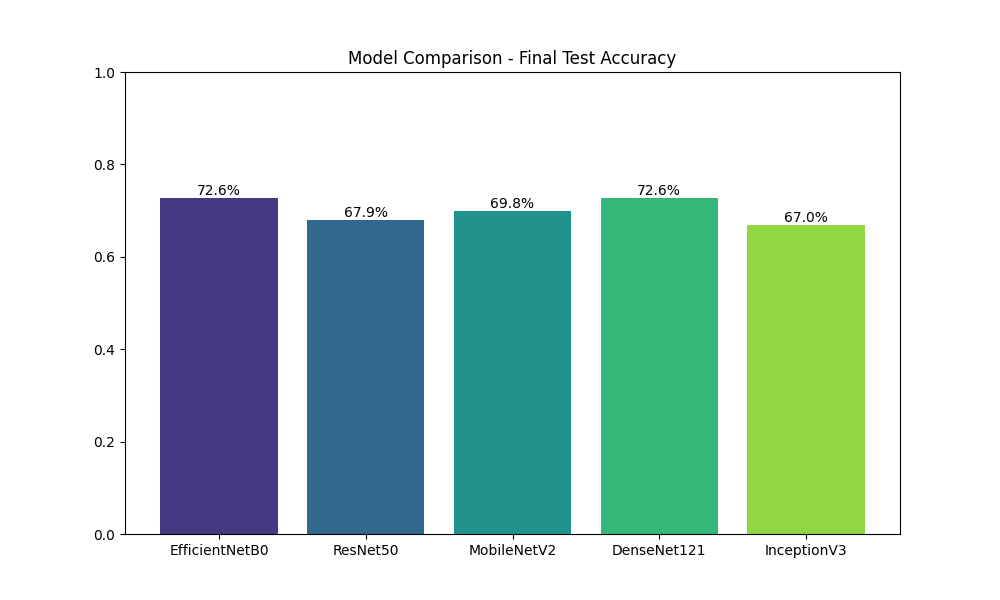
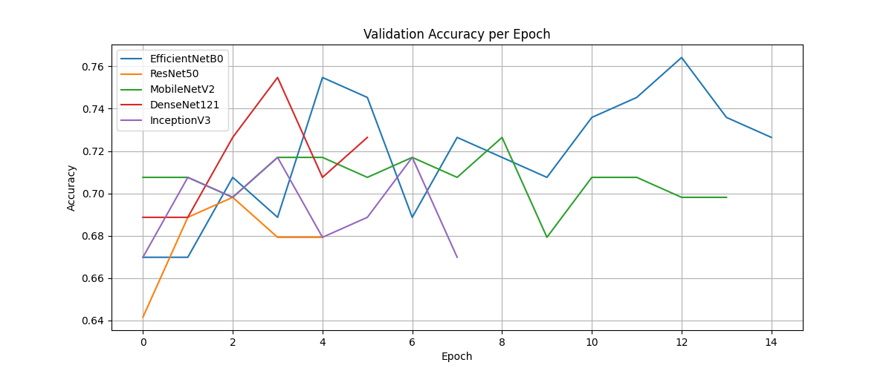
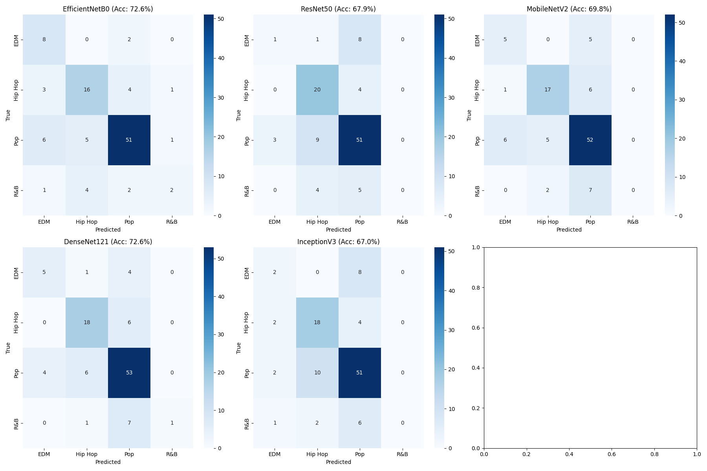

<div align="center">

# Klasifikasi Genre Musik Indonesia (2016–2025)
### Transfer Learning pada CNN Berbasis Spektrogram Audio

[](https://python.org)
[](https://pytorch.org)
[]()
[]()

<br/>

**Final Project — Data Mining 2 | Kelompok 8**
**Teknologi Sains Data — Universitas Airlangga** 

| NIM | Nama |
|:---:|:-----|
| 164231013 | Sahrul Adicandra Effendy |
| 164231052 | Cuthbert Young |
| 164231061 | Evan Nathaniel Susanto |
| 164231077 | Atilla Verel Arrizqi |
| 164231095 | Mohammad Faizal Aprilianto |

</div>

---

## Daftar Isi

- [Abstract](#abstract)
- [Latar Belakang](#latar-belakang)
- [Metodologi](#metodologi)
- [Hasil dan Performa Model](#hasil-dan-performa-model)
- [Analisis Mendalam](#analisis-mendalam)
- [Konfigurasi Eksperimen](#konfigurasi-eksperimen)
- [Struktur Proyek](#struktur-proyek)
- [Cara Penggunaan](#cara-penggunaan)
- [Dataset dan Model](#dataset-dan-model)
- [Pengembangan Selanjutnya](#pengembangan-selanjutnya)
- [Referensi Kunci](#referensi-kunci)

---

## Abstract

Penelitian ini mengembangkan sistem **klasifikasi genre musik Indonesia** menggunakan representasi **Mel-Spectrogram** yang dipadukan dengan lima arsitektur **Convolutional Neural Networks (CNN)** melalui pendekatan *transfer learning*. Dataset mencakup lagu-lagu Indonesia tahun **2016–2025**, difokuskan pada empat genre utama: **Pop, Hip Hop, R&B, dan EDM**.

Hasil eksperimen menunjukkan **EfficientNetB0** sebagai arsitektur terbaik dengan **F1-Score 0.73** dan akurasi validasi **74.5%**, melampaui DenseNet121, MobileNetV2, ResNet50, dan InceptionV3. Penelitian ini juga mengungkap tantangan signifikan akibat *class imbalance* pada dataset musik lokal Indonesia.

**Keywords:** `music genre classification` | `Mel-Spectrogram` | `CNN` | `transfer learning` | `EfficientNetB0` | `class imbalance`

---

## Latar Belakang

Pertumbuhan pesat platform musik digital (Spotify, YouTube, Apple Music) menghasilkan volume data audio yang masif, sekaligus menuntut sistem klasifikasi genre yang akurat. Penelitian ini berfokus pada:

- **Tantangan utama:** Ketidakseimbangan kelas (*class imbalance*) yang ekstrem pada dataset musik Indonesia, di mana genre Pop dan Hip Hop mendominasi secara signifikan
- **Pendekatan:** Komparasi komprehensif 5 arsitektur CNN modern melalui *transfer learning* berbasis representasi Mel-Spectrogram
- **Konteks lokal:** Evaluasi spesifik pada karakteristik musik Indonesia yang heterogen, periode 2016–2025

---

## Metodologi

### Pipeline Keseluruhan

```
┌─────────────────┐    ┌──────────────────────┐    ┌───────────────────────┐
│  Data Collection │───>│ Metadata Preprocessing│───>│  Audio Preprocessing  │
│                 │    │                      │    │                       │
│  - Apple Music  │    │  - Normalisasi teks  │    │  - WAV, 22.050 Hz     │
│  - Spotify      │    │  - Genre mapping:    │    │  - Stereo (2-ch)      │
│  - LastFM       │    │    Pop, Hip Hop,     │    │  - Durasi tetap 120s  │
│  - YouTube      │    │    R&B, EDM          │    │                       │
└─────────────────┘    └──────────────────────┘    └───────────┬───────────┘
                                                               │
                                            ┌──────────────────▼──────────────────┐
                                            │         Feature Extraction           │
                                            │  Mel-Spectrogram (64 bands, Log-dB) │
                                            │  Output Tensor: (2, 64, Time)        │
                                            └──────────────────┬──────────────────┘
                                                               │
                                            ┌──────────────────▼──────────────────┐
                                            │    Transfer Learning CNN Training    │
                                            │                                      │
                                            │  Models  : EfficientNetB0, ResNet50  │
                                            │            MobileNetV2, DenseNet121  │
                                            │            InceptionV3               │
                                            │                                      │
                                            │  Optimizer : AdamW (lr=1e-4)         │
                                            │  Split     : Stratified 80:20        │
                                            │  Precision : Mixed (AMP)             │
                                            │  Stopping  : Early (patience=3)      │
                                            └──────────────────┬──────────────────┘
                                                               │
                                            ┌──────────────────▼──────────────────┐
                                            │              Evaluation              │
                                            │  Accuracy | Precision | Recall | F1  │
                                            │  Confusion Matrix per arsitektur     │
                                            └─────────────────────────────────────┘
```

### Konfigurasi Pra-Pemrosesan Audio

| Parameter | Nilai | Keterangan |
|:----------|:-----:|:-----------|
| Format | WAV | Konversi dari berbagai format sumber |
| Sample Rate | 22.050 Hz | Standar analisis musik |
| Channel | Stereo (2-ch) | Mono diduplikasi; >2ch dipotong |
| Durasi | 120 detik | Train: segmen acak; Val/Test: segmen tengah |
| Mel Bands | 64 | Representasi frekuensi skala Mel |
| Skala | Logaritmik (dB) | Meniru sensitivitas pendengaran manusia |
| Output Tensor | (2, 64, T) | Input ke arsitektur CNN |

---

## Hasil dan Performa Model

### Tabel Komparasi Model

| Peringkat | Arsitektur | Precision | Recall | F1-Score | Val. Accuracy |
|:---------:|:-----------|:---------:|:------:|:--------:|:-------------:|
| 1 | **EfficientNetB0** | **0.73** | **0.75** | **0.73** | **74.5%** |
| 2 | DenseNet121 | 0.66 | 0.73 | 0.69 | 72.6% |
| 3 | MobileNetV2 | 0.62 | 0.71 | 0.65 | 70.8% |
| 4 | InceptionV3 | 0.60 | 0.68 | 0.63 | 67.9% |
| 5 | ResNet50 | 0.58 | 0.69 | 0.62 | 68.9% |

### Visualisasi Performa

**Perbandingan Akurasi Validasi Terbaik**



**Kurva Pelatihan per Epoch**



**Confusion Matrix — 5 Arsitektur**



---

## Analisis Mendalam

### Mengapa EfficientNetB0 Unggul?

EfficientNetB0 menerapkan prinsip **compound scaling** — menyeimbangkan kedalaman, lebar, dan resolusi jaringan secara simultan. Dengan hanya **5.3 juta parameter** dibanding ResNet50 yang memiliki 25M+, model ini lebih efisien dan tidak mudah *overfit* pada dataset berukuran sedang seperti dataset lagu Indonesia ini.

### Dampak Class Imbalance

Visualisasi distribusi genre menunjukkan ketimpangan yang ekstrem:

```
Pop      ██████████████████████████████  (Mayoritas Ekstrem)
Hip Hop  ████████████████
R&B      █████                           (Minoritas)
EDM      ████                            (Minoritas)
```

Implikasi pada performa model:
- **R&B** — genre paling sulit diprediksi akibat jumlah sampel sangat sedikit
- **EDM** — EfficientNetB0 berhasil memprediksi 7 sampel dengan benar; ResNet50 gagal total (0 benar)
- **Pop vs. Hip Hop** — terjadi kebingungan di semua model akibat irisan fitur spektral yang besar

### Studi Kasus: Prediksi Nyata

**Klasifikasi Berhasil** — *Lil Pump - "Gucci Gang"* `(Ground Truth: Hip Hop)`

| Model | Prediksi | Confidence |
|:------|:--------:|:----------:|
| **EfficientNetB0** | Hip Hop | **97.9%** |
| MobileNetV2 | Hip Hop | 97.9% |
| DenseNet121 | Hip Hop | 85.1% |
| InceptionV3 | Hip Hop | 79.7% |
| ResNet50 | Hip Hop | 67.2% |

> Genre dengan ciri akustik yang kuat (bass berat, vokal rap repetitif) mudah dipelajari oleh semua arsitektur CNN.

**Misklasifikasi Kolektif** — *Ed Sheeran - "Shape Of You"* `(Ground Truth: Pop)`

| Model | Prediksi | Confidence | Confidence ke Pop |
|:------|:--------:|:----------:|:-----------------:|
| **EfficientNetB0** | R&B | 65.5% | **28.3%** |
| MobileNetV2 | R&B | 77.8% | 13.9% |
| DenseNet121 | R&B | 74.5% | 8.2% |
| InceptionV3 | R&B | 55.6% | 7.2% |
| ResNet50 | R&B | 58.9% | 8.3% |

> Meski semua model salah, EfficientNetB0 tetap memberikan probabilitas tertinggi ke kelas yang benar (Pop: 28.3%), membuktikan sensitivitas fitur yang lebih baik.

---

## Konfigurasi Eksperimen

```python
CONFIG = {
    # Optimizer
    "optimizer":        "AdamW",
    "learning_rate":    1e-4,
    "weight_decay":     1e-2,

    # Batch & Accumulation
    "batch_size":       4,      # Effective batch = 32 via gradient accumulation
    "accum_steps":      8,

    # Training Schedule
    "max_epochs":       15,
    "early_stopping":   3,      # Patience (epochs tanpa improvement)

    # Loss & Precision
    "loss_function":    "CrossEntropyLoss",
    "precision":        "Mixed (AMP + GradScaler)",

    # Data Split
    "split_strategy":   "Stratified 80:20",

    # Audio Config
    "sample_rate":      22050,
    "mel_bands":        64,
    "audio_duration":   120,    # seconds
}
```

---

## Struktur Proyek

```
Final-Project-Datmin2/
│
├── DM2_A2_013_052_061_077_095.ipynb       # Notebook utama (EDA + Training)
├── 1. Kelompok 8_Data Mining_...ipynb     # Notebook eksplorasi awal
│
├── Modelling.py                           # Script training lengkap (semua model)
├── Modelling_Fix.py                       # Script training (versi final)
├── Predict_Genre.py                       # Inferensi genre dari file audio
├── Generate_Report.py                     # Generate laporan evaluasi
├── Flowchart.Rmd                          # Flowchart metodologi
│
├── 2016.csv ... 2025.csv                  # Metadata lagu per tahun
│
├── results/
│   ├── akurasi_per_genre.png
│   ├── confusion_matrix.png
│   ├── learning_curve.png
│   ├── tren_genre_tahunan.png
│   └── ...                               # Visualisasi hasil training awal
│
└── results_comparison/
    ├── confusion_matrices.png             # Confusion matrix 5 model
    ├── model_accuracy_comparison.png      # Bar chart akurasi
    ├── training_curves.png               # Kurva training per epoch
    ├── classification_reports.txt        # Laporan klasifikasi lengkap
    └── viz_best/                         # Visualisasi model terbaik
```

> **Catatan:** File model (`*.pth`) tidak disertakan di repo karena melebihi batas ukuran GitHub (100 MB). Unduh via Google Drive di bawah.

---

## Cara Penggunaan

### 1. Install Dependencies

```bash
pip install torch torchvision torchaudio librosa numpy pandas scikit-learn matplotlib seaborn
```

### 2. Prediksi Genre dari File Audio

```bash
python Predict_Genre.py --audio "path/to/song.mp3" --model efficientnetb0
```

### 3. Melatih Ulang Model

```bash
python Modelling_Fix.py
```

### 4. Generate Laporan Evaluasi

```bash
python Generate_Report.py
```

### 5. Eksplorasi via Notebook

```bash
jupyter notebook DM2_A2_013_052_061_077_095.ipynb
```

---

## Dataset dan Model

| Resource | Deskripsi | Link |
|:---------|:----------|:----:|
| Dataset Audio + Metadata | Kumpulan lagu Indonesia 2016–2025 (Apple Music, Spotify, LastFM, YouTube) | [Google Drive](https://drive.google.com/drive/u/0/folders/1ldNJaW2lq5XYQMmqRE-sW2N7WopAvbkw) |
| Pre-trained Model Weights | Best model `.pth` untuk 5 arsitektur CNN | [Google Drive](https://drive.google.com/drive/u/1/folders/1sBRK8eQbu1MWOS27pDV0d95N0MF6QTif) |

---

## Pengembangan Selanjutnya

| Area | Teknik yang Direkomendasikan | Manfaat |
|:-----|:-----------------------------|:--------|
| Loss Function | **Focal Loss** | Mengurangi bias dominasi kelas mayoritas (Pop) |
| Augmentasi Data | **SpecAugment** | Memperkaya variasi spektrogram data latih |
| Model Architecture | **Audio Spectrogram Transformer (AST)** | Menangkap dependensi temporal jangka panjang |
| Hybrid Architecture | **CNN-RNN / CRNN** | Menggabungkan fitur spasial dan temporal |
| Dataset | Perluasan ke 9 genre penuh | Representasi musik Indonesia lebih komprehensif |

---

## Referensi Kunci

- Tan, M., & Le, Q. V. (2019). **EfficientNet: Rethinking model scaling for convolutional neural networks.** *ICML 2019.*
- Gong, Y., Chung, Y. A., & Glass, J. (2021). **AST: Audio Spectrogram Transformer.** *Interspeech 2021.*
- Park, D. S., et al. (2019). **SpecAugment: A simple data augmentation method for automatic speech recognition.** *Interspeech 2019.*
- Lin, T. Y., et al. (2017). **Focal loss for dense object detection.** *ICCV 2017.*
- Ashraf, M., et al. (2023). **A hybrid CNN and RNN variant model for music classification.** *Applied Sciences, 13(3), 1476.*
- Rosmala, D., & Fadhilah, M. N. (2025). **Audio Conversion for Music Genre Classification Using STFT and InceptionV3.** *Elkomika, 13(1).*
- Zhang, T., Chen, H., & Luo, X. (2022). **Addressing data imbalance in music classification.** *IEEE Transactions on Multimedia, 24.*

---

<div align="center">

Kode Kelompok: `DM2_A2_013_052_061_077_095`

*Final Project Data Mining 2 — Semester 5, 2025*

</div>
